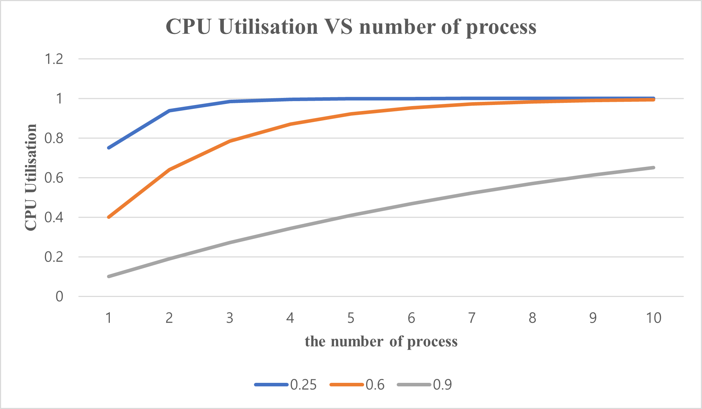
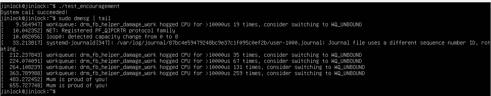

# ECE482 2024FA H2
## Author
- Name: **JINLOCK CHOI**
- Student No.: **520370990012**
- E-mail: **jinlock99@sjtu.edu.cn**

## Exercises
### Ex. 1 Multiprogramming
A few years ago when computers featured less RAM it is was common to increase it in order to enhance CPU performance. In order to better understand the link between the two we now create a simple model for multiprogramming. We assume all the processes to be similar and spending the same fraction *p* of their time waiting for Input/Output (I/O) to complete.

1. What is the probability for *n* processes to be waiting at the same time, then express the CPU utilisation as a function of *n*?  

    > Since all the processes spend the same fraction *p*, the probability for *n* processors waiting at the same time will be **p^n**. Thus, the CPU utilisation is **1-p^n**.

2. Sketch the curve representing the CPU utilisation as a function of the number of processes for the following values of *p*: 25%, 60%, and 90%.  

    

3. A certain old computer has 256 MB of RAM, once loaded a light operating system uses 96 MB of RAM. Several programs are launched each of them using 48 MB.  

    - How many processes can be stored simultaneously in memory?  

        > 48 * 4 > 256 - 96 - 160 > 48 * 3. Therefore, **three** processes can be stored simultaneously.

    - Assuming an average of 90% I/O waiting time what is the CPU utilisation?

        > We know CPU utilisation is **1 - p^n**. Thus, 1 - 0.9^3 = 0.271.  
        **CPU Utilisation = 0.271**

    - What is the effect of adding 256 MB, 512 MB and 1024 MB of RAM. Argue on which amount would be the most beneficial and would be worth the investment.

        - For adding 256 MB: (256 + 256 - 96) / 48 = 8.66, 8 processes.  
        CPU utilisation: 1 - 0.9^8 = 0.5695  
        Increase 0.2985 per 256 MB.
        - For adding 512 MB: (256 + 512 - 96) / 48 = 14, 14 processes.  
        CPU utilisation: 1 - 0.9^14 = 0.7712  
        Increase 0.2501 per 256 MB.
        - For adding 1024 MB: (256 + 1024 - 96) / 48 = 24.66, 24 processes.  
        CPU utilisation: 1 - 0.9^24 = 0.9202  
        Increase 0.1623 per 256 MB.  

        > Therefore, adding **256 MB** is most beneficial and worth to invest.

### Ex 2. Understanding system calls

1. Briefly introduce `strace` and `ltrace`. Explain they could be helpful along the semester.

    - `strace`: A tool that traces and logs all the system calls mande by a process, such as file operations, memory allocation, and interactions with hardware.

    - `ltrace`: A tool that tracks library function calls made by a process, showing calls to functions in shared libraries (e.g., `libc`).

    > These tools could be helpful because they are both powerful diagnostic tools used for debugging and monitoring system calls and library function calls made by a program.

2. What are the `manpages` sections for system calls and library calls?

    - System calls are documented in **Section 2** of the `manpages`.
    - Library calls are documented in **Section 3** of the `manpages`.

3. System calls.

    - What are the main types of system calls?
        
        - Process Control
        - File Management
        - Device Management
        - Memory Management
        - Communication (IPC - Interprocess Communication)
        - Information Maintenance
        - Security/Protection

    - Run `strace` on the `ls` command and classify all the listed system calls.

        - `execve`
        - `brk`
        - `arch_prctl`
        - `access`
        - `openat`
        - `fstat`
        - `mmap`
        - `close`
        - `read`
        - `pread64`
        - `mprotect`
        - `munmap`
        - `set_tid_address`
        - `set_robust_list`
        - `rt_sigaction`
        - `rt_sigprocmask`
        - `prlimit64`
        - `statfs`
        - `futex`
        - `ioctl`
        - `getdents64`
        - `write`
        - `exit_group`

    - Select a line of your choice in `strace` output and explain its meaning.

        - `execve("/usr/bin/ls", ["ls"], 0x7ffd53614070 /* 24 vars */) = 0`:  
        The `execve` call is requesting to execute the `/usr/bin/ls` program with the argument `"ls"`, inheriting 24 environment variables. The `= 0` at the end indicates that the system call succeeded, meaning the `ls` program was successfully loaded and is now running in place of the current process.

    - How to attach `strace` to a running process? Describe a scenario where this could be handy.  

        - Attaching: `strace -p pid` or `strace --attach=pid`
        - Detaching: `Ctrl-C`  

        - Handy scenario:
            > A handy scenario for attaching `strace` to a running process is **troubleshooting a hanging or unresponsive application**.  
            For instance, if a server or program seems frozen but is still running, I can use `strace` to observe its system calls in real-time.  
            By doing this, I can diagnose the issue without needing to restart the process, helping to minimize downtime and avoid disrupting service.
    
### Ex 3. A simple system call

1. Kernel printing

    - What is the counterpart of `printf()` when working inside the Linux kernel?

        `printk()`  
    
    - Write the body a simple "kernel function" displaying "Mum is proud of you!"

        ```
        printk(KERN_INFO "Mum is proud of you!\n");
        ```

2. Headers and function name.

    - What header files should be included when adding a new system call?

        - `<linux/syscalls.h>`
        - `<linux/kernel.h>`
        - `<linux/init.h>`
        - `<linux/uaccess.h>`
        - `<linux/types.h>`
        - `<asm/current.h>`
        - `<linux/errno.h>`

    - How are the macros `SYSCALL_DEFINE0` and `SYSCALL_DEFINEx` working?

        - `SYSCALL_DEFINE0`: Used to define a system call that takes **no arguments**.
        - `SYSCALL_DEFINEx`: Used to define a system call that takes **x arguments**.  
        `x`: any number from 1 to 6.

    - Use the `SYSTEM_DEFINE0` to define the new system call `encouragement`. Name your file `encouragement.c` and save it in a folder `encouragement` at the root of the kernel source code.

        ```
        // encouragement.C

        #include <linux/kernel.h>
        #include <linux/syscalls.h>

        SYSCALL_DEFINE0(encouragement) {
            printk(KERN_INFO "Mum is proud of you!\n");
            return 0;
        }
        ```

3. Makefile and Kbuild

    - Jump to the end of `Kbuild` file and following the same patterns as on the last few lines, add your `encouragement` directory there.

        `obj-y			+= encouragement/`

    - Check the Makefiles for the directories listed at the end of `Kbuild` file and create a Makefile for your `encouragement` directory.  

        `obj-y += encouragement.o`


4. System call registration.

    - Add your new system call to `syscalls.h`.

        - path: include/linux/syscalls.h
        - `asmlinkage long sys_encouragement(void);`


    - Add your new system call to `syscall_64.tbl`.

        - path: arch/x86/entry/syscalls/syscall_64.tbl
        - `548 64  encouragement  sys_encouragement`

5. Recompile the kernel and reboot (do not forget to update the bootloader).

    ```
    make CC=clang -j$(nproc)

    sudo make modules_install
    sudo make install

    sudo update-grub

    sudo reboot
    ```

6. Write a simple user space program to demonstrate the well functioning of your system call.

    - test_encouragement.c:

        ```
        #include <stdio.h>
        #include <unistd.h>
        #include <sys/syscall.h>

        #define SYS_ENCOURAGEMENT 548

        int main() {
            long result = syscall(SYS_ENCOURAGEMENT);

            if (!result) {
                printf("System call succeeded!\n");
            } else {
                printf("System call failed: %ld\n", result);
            }

            return 0;
        }

        ```

    - Compile and Run:

        ```
        gcc -o test_encouragement test_encouragement.c
        
        ./test_encouragement
        ```

    - Result:

        