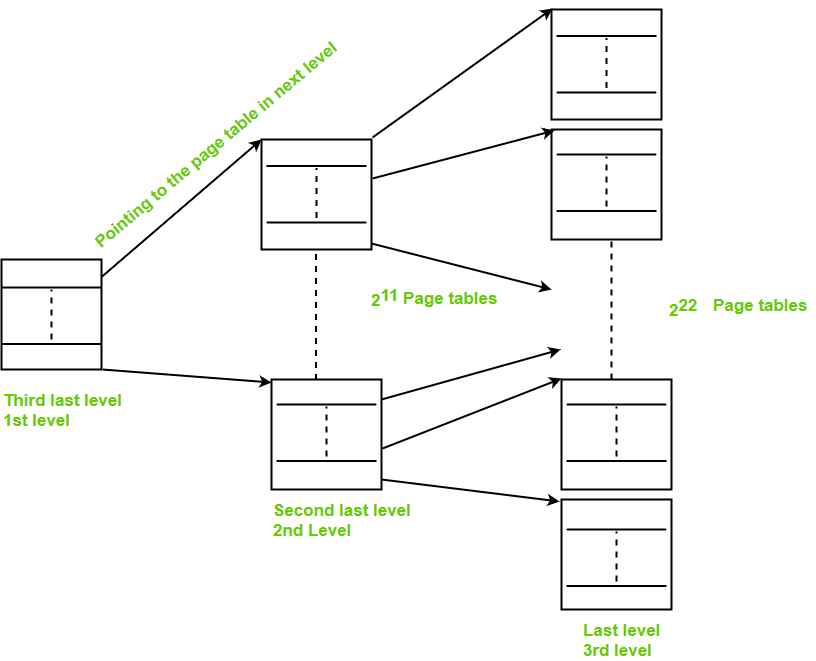

# h6
## ECE4820 Exercises
### Ex. 1 Simple Questions
1. Consider a swapping system in which memory consists of the following hole sizes in memory order: 10 KB, 4 KB, 20 KB, 18 KB, 7 KB, 9 KB, 12 KB, and 15 KB. Assuming first fit is used, which hole is taken for successive segment requests of: (i) 12 KB, (ii) 10 KB, and (iii) 9 KB. Repeat for best fit and quick fit.

    - **First Fit**:
        - 12 KB: *20 KB*
        - 10 KB: *10 KB*
        - 9 KB: *18 KB*

    - **Best Fit**:
        - 12 KB: *12 KB*
        - 10 KB: *10 KB*
        - 9 KB: *9 KB*

    - **Quick Fit**:
        - 12 KB: *12 KB*
        - 10 KB: *10 KB*
        - 9 KB: *9 KB*

2. If an instruction takes 10 nsec and a page fault takes an additional *n* nsec, give a formula for the effective instruction time if page faults occur every *k* instructions.

    - **$T = (10 * k + n) / k$**
    - **$T = 10 + n/k$** ***nsec***

3. A small computer has four page frames. At the first clock tick, the *R* bits are 0111. At *t* subsequent clock tics, the values are 1011, 1010, 1101, 0010, 1010, 1100, and 0001. Assuming the aging algorithm is used with an 8-bit counter what is the value of the four counters after the last tick.

    - Tick = 1, R = 0111
        - Page 0: 00000000
        - Page 1: 10000000
        - Page 2: 10000000
        - Page 3: 10000000

    - Tick = 2, R = 1011
        - Page 0: 10000000
        - Page 1: 01000000
        - Page 2: 11000000
        - Page 3: 11000000

    - Tick = 3, R = 1010
        - Page 0: 11000000
        - Page 1: 00100000
        - Page 2: 11100000
        - Page 3: 01100000

    - Tick = 4, R = 1101
        - Page 0: 11100000
        - Page 1: 10010000
        - Page 2: 01110000
        - Page 3: 10110000

    - Tick = 5, R = 0010
        - Page 0: 01110000
        - Page 1: 01001000
        - Page 2: 10111000
        - Page 3: 01011000

    - Tick = 6, R = 1010
        - Page 0: 10111000
        - Page 1: 00100100
        - Page 2: 11011100
        - Page 3: 00101100
    
    - Tick = 7, R = 1100
        - Page 0: 11011100
        - Page 1: 10010010
        - Page 2: 01101110
        - Page 3: 00010110

    - Tick = 8, R = 0001
        - Page 0: 01101110
        - Page 1: 01001001
        - Page 2: 00110111
        - Page 3: 10001011

```bash
// ANSWER:

01101110 // Page 0
01001001 // Page 1
00110111 // Page 2
10001011 // Page 3
```

### Ex. 2 Page Tables
In the lecture, it was mentioned that the translation from virtual address into physical address could be sped up using the TLB. Unfortunately, this solution is not much help in the case of large page tables. **Investigate the two following alternative solutions: *inverted page tables* and *multilevel page tables*.**

#### 1. Inverted Page Tables
An **inverted page table** is a single global table that contains one entry for each physical page frame in memory, rather than one entry for each virtual page in the process's virtual address space. It is commonly used in systems with large virtual address spaces to save memory.


[1] https://www.geeksforgeeks.org/inverted-page-table-in-operating-system/

- **Global Table**: Unlike traditional page tables, there is only one inverted page table for the entire system, shared by all processes.
- **Mapping**: Each entry in the table contains:
    1. The virtual page number.
    2. The process ID
    3. Metadata
- **Hashing**: A hash function is used to map the virtual page number and process ID to a specific location in the inverted page table.

#### 2. Multilevel Page Tables
A **multilevel page table** is a hierarchical structure where a single large page table is broken into smaller page tables, reducing memory overhead. It allows the operating system to avoid allocating space for the entire page table upfront.


[2] https://www.geeksforgeeks.org/multilevel-paging-in-operating-system/

- **Structure**:
    - The virtual address is divided into multiple parts, each representing an index at a specific level of the hierarchy.
    - For example, in a **two-level page table**:
        - The first part of the virtual address indexes into the top-level page table (page directory).
        - The second part indexes into a lower-level page table.
        - The final offset specifies the location within the physical page.
- **Hierarchical**: Instead of one large table, you have multiple smaller tables, linked together hierarchically.
- **On-Demand Allocation**: Lower-level tables are allocated only when needed, reducing memory usage.

### Ex. 3 Research
Write about half a page on the topic of codes bugs that lead to security holes; In particular illustrate the discussion using common examples. Do not forget to reference your sources of information.

#### Code Bugs Leading to Security Holes
Software bugs create vulnerabilities that attackers exploit to manipulate programs, steal data, or execute malicious code. Recognizing common bugs like buffer overflows, SQL injections, and improper input validation is essential to developing secure software and preventing security issues.

#### Example: Buffer Overflow
A buffer overflow occurs when a program writes more data to a buffer than it can hold, potentially overwriting adjacent memory. This can allow attackers to execute malicious code or alter program behavior.

- Example:

    ```C
    #include <stdio.h>
    #include <string.h>

    void vulnerable_function() {
        char buffer[8]; // Small buffer with only 8 bytes
        printf("Enter some text: ");
        gets(buffer); // Unsafe function allows writing beyond buffer bounds
        printf("You entered: %s\n", buffer);
    }

    int main() {
        vulnerable_function();
        return 0;
    }
    ```
    
- What Happens?
    - The buffer array is only 8 bytes, but the gets() function does not check input length.
    - If a user inputs more than 8 characters, the extra data overwrites adjacent memory, including the return address of the function on the stack.
    - An attacker can exploit this by crafting input that includes malicious code and overwrites the return address to point to this code, leading to arbitrary code execution.

- Exploit Example:
    - Suppose the attacker inputs:
    
        ```
        AAAAAAAAAAAA\xde\xad\xbe\xef

        ```

    - Here:
        - The "A"s overwrite the buffer.
        - The \xde\xad\xbe\xef (hexadecimal) overwrites the function's return address, redirecting execution to a malicious location.
    

#### Reference
[3] Aleph One (1996). Smashing The Stack For Fun And Profit.

### Ex. 4 Linux
**Thrashing** occurs in a computer system when the operating system spends more time swapping pages between main memory and disk (paging) than executing actual processes. It leads to severe performance degradation as the system becomes overwhelmed with managing memory instead of running programs.

```C
#include <stdio.h>
#include <stdlib.h>

#define SIZE 1000000  
#define STEP 100   

int main() {
    int *array = (int *)malloc(SIZE * sizeof(int));  

    for (int i = 0; i < SIZE; i += STEP) {
        array[i] = i; 
    }

    printf("Program finished\n");
    free(array);
    return 0;
}

```

1. Thrashing Cause:

    - The program accesses a large array with a step size (STEP = 100) that skips many elements, resulting in poor locality of reference.
    - Each memory access may map to a new page, leading to excessive page faults if the working set exceeds the available physical memory.

2. Effect:

    If the system has limited physical memory, it constantly swaps pages in and out of memory (thrashing), severely degrading performance.

## ECE4821 Exercise
### Ex. 5 Research
#### 1. Explain what Meltdown and Spectre are. Focus on the hardware and OS part of those attacks. Also explain the idea behind the fixes.
**Meltdown** and **Spectre** are CPU vulnerabilities caused by speculative execution, exposing sensitive data.

- **Meltdown**: Exploits privilege separation flaws, allowing user processes to read kernel memory. It primarily affects Intel CPUs and is mitigated by Kernel Page Table Isolation (KPTI), which separates user and kernel memory. This increases security but causes performance overhead during system calls.

    - Meltdown Fixes:

        - **Kernel Page Table Isolation (KPTI)**: Separates user and kernel memory to block speculative access to kernel data. It improves security but causes performance overhead during user-kernel switches.
        - **Hardware Fixes**: Newer CPUs include protections against unauthorized speculative reads.

- **Spectre**: Exploits speculative execution and branch prediction, leaking data within or across processes. It affects Intel, AMD, and ARM CPUs. Mitigations include retpolines (compiler changes to prevent unsafe speculation), software fences, OS patches, and hardware updates with speculative execution barriers. Fixes are more complex than Meltdown and impact performance in workloads using branch-heavy operations.

    - Spectre Fixes:

        - **Retpolines**: Prevent unsafe speculative execution by controlling indirect branches during compilation.
        - **Software Fences**: Insert barriers in code to limit speculative execution.
        - **Firmware Updates**: Modify CPU behavior to disable or mitigate speculative risks.
        - **Hardware Fixes**: New CPUs improve branch prediction and add speculative barriers.

#### 2. Search and explain what the Dirty COW bug is
The **Dirty COW** vulnerability, identified as CVE-2016-5195, is a critical security flaw in the Linux kernel's memory management subsystem. Discovered in 2016, it affects Linux kernel versions prior to 4.8.3. 

- Technical Overview:

    Dirty COW exploits a race condition in the kernel's implementation of the Copy-On-Write (COW) mechanism. COW is designed to optimize memory usage by allowing multiple processes to share the same memory pages until a write operation is performed. When a process attempts to modify a shared page, the kernel creates a private copy for that process. The vulnerability arises because, under certain conditions, an unprivileged local user can gain write access to read-only memory mappings. 

- Impact:

    Exploiting Dirty COW allows an attacker to escalate privileges on the system. For instance, an attacker could modify files they typically cannot write to, such as those owned by the root user, leading to unauthorized access or system compromise. Notably, this vulnerability has been exploited in the wild, highlighting its severity. 

- Mitigation:

    To protect systems from Dirty COW, it's essential to update the Linux kernel to version 4.8.3 or later, where the vulnerability has been patched. Additionally, applying security patches provided by Linux distributions and employing security best practices can help mitigate potential risks. 
