# ECE4820J 2024FA LAB 1
## Author
- Name: **JINLOCK CHOI**
- Student No.: **520370990012**
- E-mail: **jinlock99@sjtu.edu.cn**

## 1. Hardware Overview
### Figures
<center>
    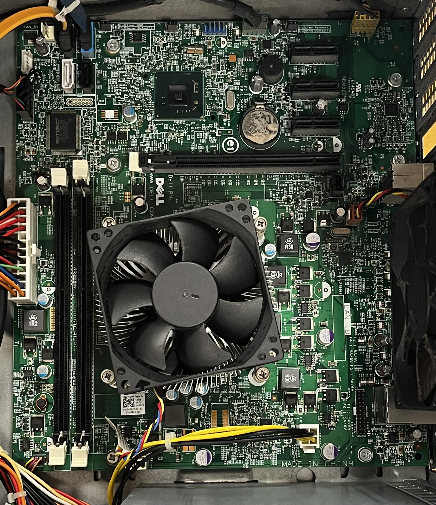
<br>Figure 1. The motherboard<br><br>
    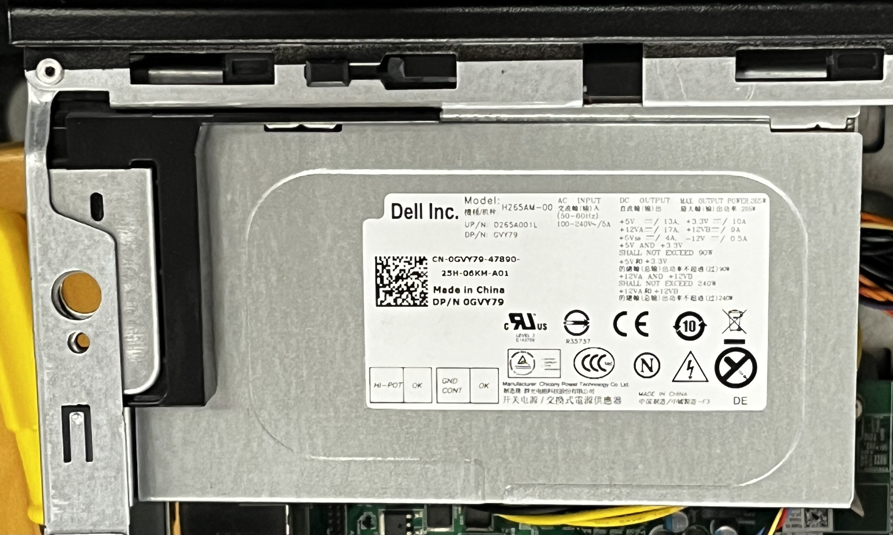
<br>Figure 2. The PC power supply<br><br>
    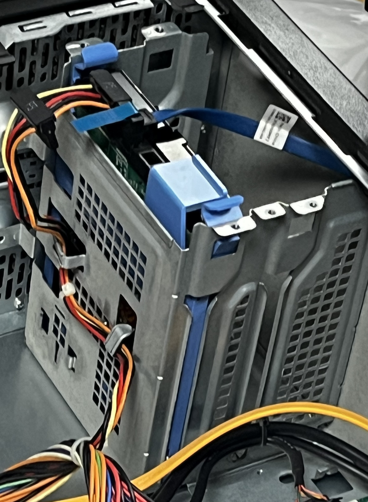
<br>Figure 3. A Hard Disk Drive<br><br>
    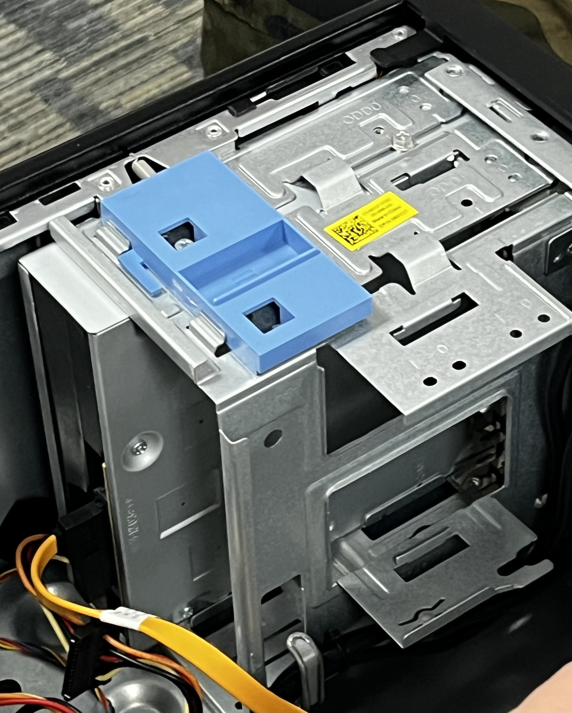
<br>Figure 4. An Optical disk drive<br>
<br>!! PCI Card is Missing<br><br>
    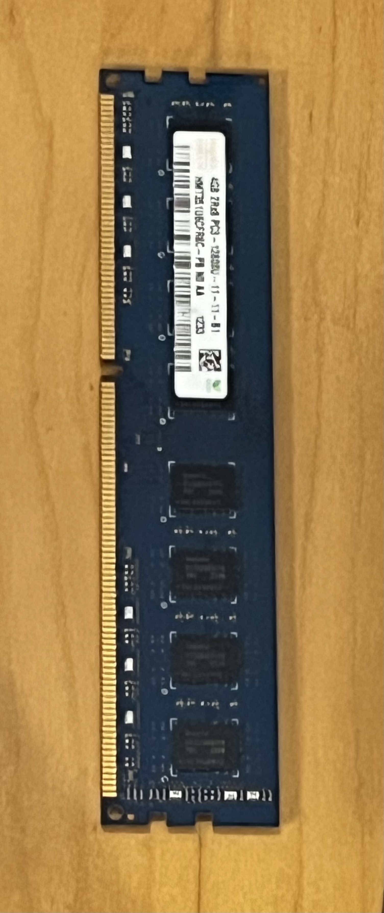
<br>Figure 5. The RAM<br><br>
    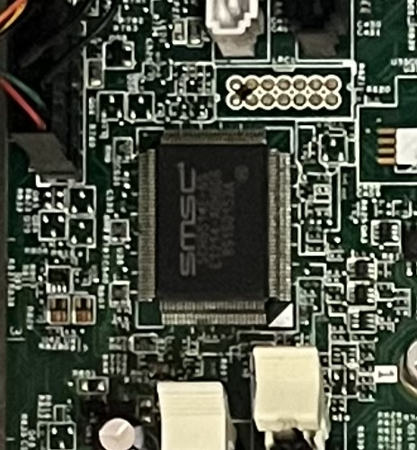
<br>Figure 6. The South bridge (There is no North bridge)<br><br>
    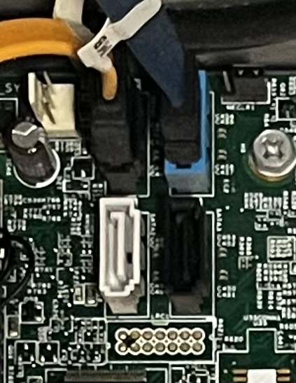
<br>Figure 7. A SATA socket<br><br>
    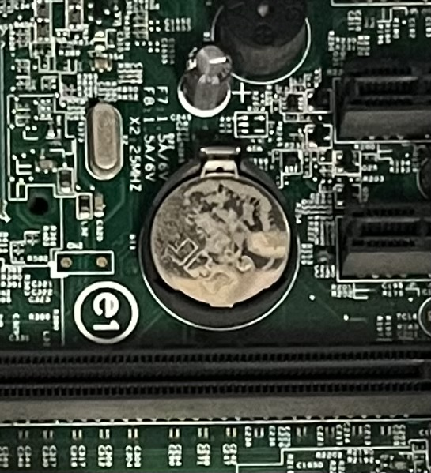
<br>Figure 8. The battery<br><br>
    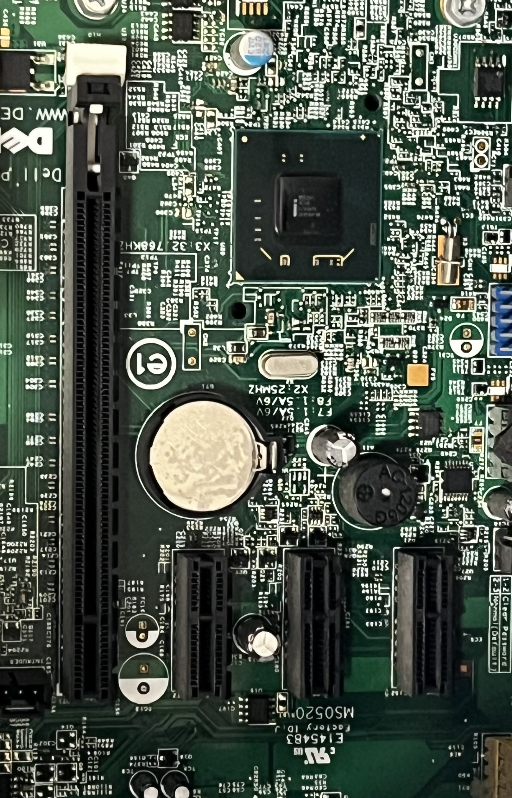
<br>Figure 9. A PCI/PCI-e slot<br><br>
    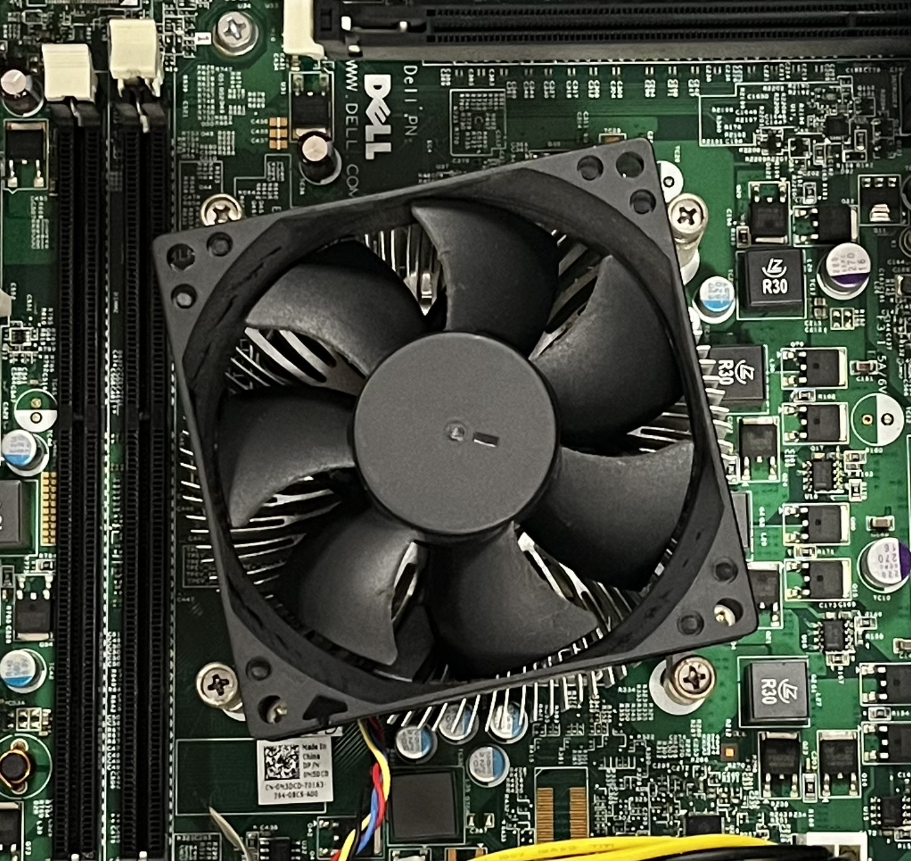
<br>Figure 10. The CPU<br><br>
    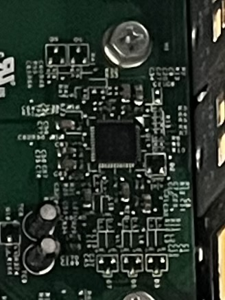
<br>Figure 11. The BIOS<br><br>
</center>

### Questions
- Where is the CPU hidden, and why?
    > The CPU is hidden under a fan as Figure 10 shows. The reasons are to protect CPU, to cool down, and to ensure solid connection with other units.
- What are the North and South bridges?
    > The Northbridge and Southbridge were components of computer's chipset that managed communication between the CPU and other system parts. The Northbridge handled high-speed connections, like communication with RAM and the GPU, while the Southbridge managed slower peripherals, such as hard drives and USB devices.
- How are the North and South bridges conntected together?
    > The Northbridge and Southbridge were connected directly on the motherboard through a dedicated bus, allowing them to communicate and coordinate data transfers between high-speed components (managed by the Northbridge) and lower-speed peripherals (managed by the Southbridge).
- What is the BIOS?
    > The BIOS (Basic Input/Output System) is firmware on the motherboard that initializes hardware and helps start the computer by preparing it to load the operating system. It also allows users to configure hardware settings.
- Take out the CPU, rotate it and try to plug in back in a different position, is that working?
    > CPU cannot be plugged in a different position. It will not work.
- Explain what overclocking is?
    > Overclocking is the process of increasing a computer component's clock speed, typically the CPU or GPU, beyond its factory-set limits to improve performance. This can result in faster processing but may generate more heat and require better cooling. It can also reduce the lifespan of the hardware if not managed properly.
- What are pins on a PCI/PCI-e card and what are they used for?
    > Pins on a PCI/PCI-e card are electrical connectors that allow communication between the card and the motherboard. They transmit data, power, and control signals, enabling the card (such as a GPU or network adapter) to interact with the rest of the computer system.
- Before PCI-e became a common standard many graphics cards were using Accelecrated Graphics Port (AGP), explain why.
    > Before PCIe became the standard, graphics cards used the Accelerated Graphics Port (AGP) because it provided a dedicated connection specifically for graphics processing, offering higher bandwidth than PCI. AGP was designed to improve 3D graphics performance by allowing faster data transfer between the GPU and the motherboard, reducing bottlenecks and enhancing overall graphics performance in games and applications.

## 2. Tasks
### Questions
- Use the *mkdir*, *touch*, *mv*, *cp*, and *ls* commands to:
    - Create a file named *test*:  
    `touch test`
    - Move *test* to *dir/test.txt*, where *dir* is a new directory:  
    `mkdir dir`  
    `mv test dir/test.txt`  
    - Copy *dir/test.txt* to *dir/test_copy.txt*:  
    `cp dir/test.txt dir/test_copy.txt`
    - List all the files contained in *dir*:  
    `ls dir -a`
- Use the *grep* command to:
    - List all the files from */etc* containing the pattern *127.0.0.1*:  
    `grep -rl 127.0.0.1 /etc`  
    - Only print the lines containing your username and root in the file */etc/passwd* (only one *grep* should be used):  
    `cat /etc/passwd | grep "jinlock\|root"`
- Use the *find* command to:
    - List all the files from */etc* that have been accessed less than 24 hours ago:  
    `find /etc -atime -1`  
    - List all the files from */etc* whose name contains the pattern "netw":  
    `find /etc -name "*netw*"`
-   In the *bash* man-page read the part related to redirections. Explain the following operators >, >>, <<<, >&1, and 2>&1. What is the use of *tee* command:
    - `>` *Redirecting Output*:  
    Redirecting the output into the file specified on the right of the \>. If the file does no exist it is created; if it does exist it is truncated to zero size.
    - `>>` *Appending Redirected Output*:  
    Redirecting the output into the file specified on the right of the \>>. If the file does not exist it is created; if it does exist, output is appended after the file's content.
    - `<<<` *Here Strings*:  
    The string on the right of the <<< is supplied as a single string, with a newline appended, to the command on its standard input.
    - `>&1` :  
    To duplicate output file descriptor.
    - `2>&1 >` :  
    Directs only the standard output to file.
        - 0: Standard Input
        - 1: Standard Output
        - 2: Standard Error
    - `tee` :  
    Read from standard input and write to standard ouput and files.
- Explain the behaviour of the *xargs* command and of the | operator:  
    - `xargs`:  
    Build and execute command lines from standard input.
    - `|` :  
    Command using within a pipe.
- What are the *head* and *tail* commands? How to "live display" a file as new lines are appended?
    - `head`:
    Output the first part of files.
    - `tail`:  
    Output the last part of files.
    - "live display":  
    `tail -f [FILE]`
- How to monitor the system using *ps*, *top*, *free*, *vmstat*?  
    - `ps`:  
    Report a snapshot of the current processes.
    - `top`:  
    Display Linux processes.
    - `free`:  
    Display amount of free and used memory in the system.
    - `vmstat`:  
    Report virtual memory statistics.
- What are the main differences between sh, bash, csh, and zsh?
    - *sh*:  
    The most prominent progenitor of modern shell.
    - *bash*:  
    Official shell.
    - *csh*:  
    The C shell.
    - *zsh*:  
    More features than *bash*.
- What is the meaning of `$0`, `$1`, ..., `$?`, `$!`?  
    - `$0`:  
    Set to first argument
    - `$1, $...`:  
    Set to Second and so on argument
    - `$?`:  
    Expands to the exit status of the most recently executed foreground pipline.
    - `$!`:  
    Expands to the process ID of the job most recently placed into the background.
- What is the use of the PS3 variable? Provide a short code example:
    - `PS3`: Prompt variable when you use SELECT in shell scripts.  
       ```
       #!bin/bash  
        PS3="Please choose one from the above options. :" 
        select option in "A" "B" "C"  
        do  
            echo  
            echo "You choose option ${option}."  
            echo   
            break  
        done
       ```
- What is the purpose of the `iconv` command, and why is it useful?
    - Reads in text in one encoding and outputs the text in another encoding.
    - Useful in handling files with different encoding.
- Given a variable `$temp` what is the effect of `${#temp}`, `${temp%%word}`, `${temp/pattern/string}`.
    - `${#temp}`:  
    The length in characters of the content of variable `temp`
    - ` ${temp%%word}`:  
    Content of variable `temp` which the longest matching pattern - produced by `word` - is deleted.
    - `${temp/pattern/string}`:  
    Content of variable `temp` which the longest match of `pattern` against its value is replace with `string`.
- Search online, how files are organized on a Unix like system. In particular what are the following directories used for:
    - */* : The root of the file system tree.
    - */lib* : Contains system libraries, and some critical files such as kernel modules or device drivers.
    - */usr/lib* : Stores the required libraries and data files for programs stored within */usr* or elsewhere.
    - */srv* : Data for service from system.
    - */sbin* : System Binaries.
    - */bin* : Stands for "binaries" and contains certain fundamental utilities, such as ls or cp, which are generally needed by all users.
    - */mnt* : Stands for "mount". Contains filesystem mount points. These are used, for example, if the system uses multiple hard disks or hard disk partitions.
    - */usr/src* : Holds the Linux kernel sources, header-files and documentation.
    - */media* : Default mount point for removable devices.
    - */dev* : Stands for "devices". Contains file representations of peripheral devices and pseudo-devices.
    - */boot* : Contains all the files that are required for successful booting process.
    - */usr/bin* : This directory stores all binary programs distributed with the operating system not residing in /bin, /sbin or (rarely) /etc.
    - */proc* : procfs virtual filesystem showing information about processes as files.
    - */opt* : Optional application software packages.
    - */vmlinuz* : A compressed Linux kernel, and it is bootable.
    - */etc* : Contains system-wide configuration files and system databases.
    - */usr/share* : For all read-only architecture independent data files.
    - */sys* : An interface to the kernel.
    - */var* : A place for files that may change often especially in size.
    - */initrd.img* : A scheme for loading a temporary root file system into memory, to be used as part of the Linux startup process.  
- REF 
    - https://www.geeksforgeeks.org/linux-file-hierarchy-structure/
    - https://www.geeksforgeeks.org/unix-file-system/
    - https://www.gnu.org/software/bash/manual/bash.html#index-0
    - https://www.gnu.org/software/bash/manual/html_node/Shell-Parameter-Expansion.html

### GAME  
    #!/bin/bash

    ans=$((($RANDOM)%100))
    while true ; do
            read -p "Please guess: " guess
            if [ $ans -eq $guess ] ; then
                    echo "You Win!"
                    break
            elif [ $ans -gt $guess ] ; then
                    echo "Larger"
            else
                    echo "Smaller"
            fi
    done