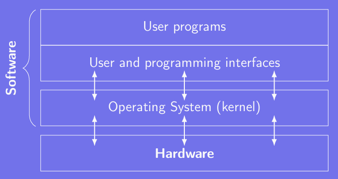
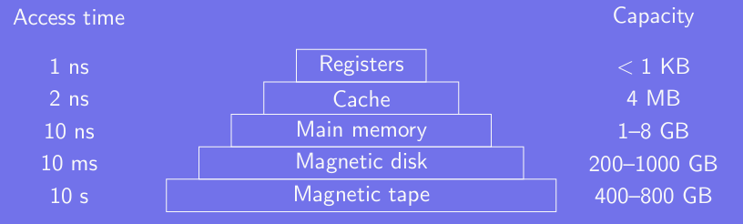
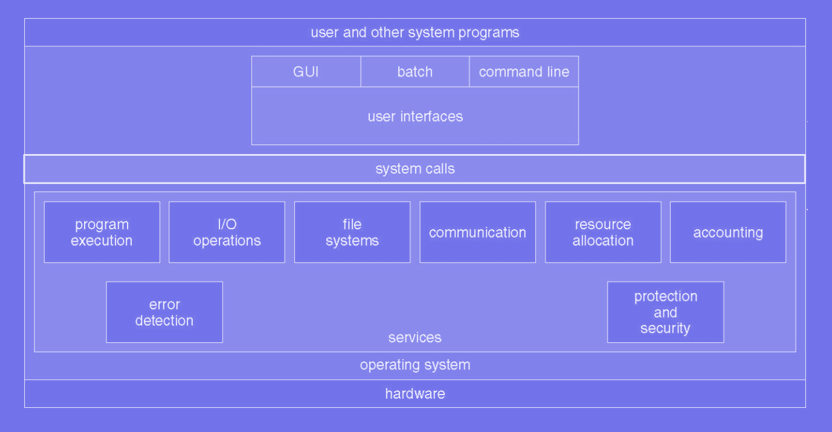
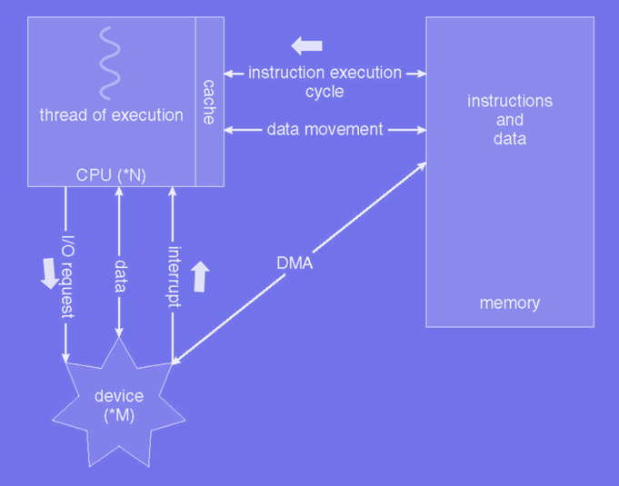

# Operating Systems Overview

## Computers and Operating Systems
### Software and hardware layout

* Job of Operating System (OS)
    - Manage & assign the hardware resources
    - Hide complicated details to the end user
    - Provide abstractions to ease interactions with the hardware.

---
---

## Hardware
### Basic PC hardware
A computer is often composed of:
- CPU
- Memory
- Monitor + video controller
- Keyboard + keyboard controller
- Hard Disk Drive (HDD) + hard disk controller
- Bus

---

### Multi-threading
* Real multi-threading:
    - Several physical CPU cores are available
    - The OS sees several CPUs and can use them all *simultaneously*.
* Hyper-threading:
    - "Fake" multi-threading
    - A physical CPU core is seen as two logical cores by the OS
    - Some resources are duplicated in each physical core
    - Hyper-threading allows a better utilization of the CPU

---

### Memory

* Memory types:
    - Random Access Memory (RAM): volatile
    - Read Only Memory (ROM)
    - Electrically Erasable PROM (EEPROM) and flash memory: slower than RAM, non-volatile
    - CMOS: save time and date, BIOS parameters
    - HDD: divided into cylinder, track and sector

---

### [ Interview 1 ] Explain the difference between the *stack* and the *heap*
- *stack*:  

        The stack is used to store the order of method execution and local variables.

- *heap*:

        The heap memory stores the objects and it uses dynamic memeory allocation and deallocation.

---

### KEY Points
1. What is the main job of an OS?

        The main job of an Operating System (OS) is to act as an intermediary between hardware and applications, managing hardware resources (CPU, memory, storage, etc.) and providing services for application program. It ensures efficient, secure, and fair resource allocation while providing a user-friendly interface.

2. Why are there so many types of OS?

    Different OS types exist to cater to diverse requirements and environments. For example:

    - *Desktop OS* (e.g., Windows, macOS) focuses on user-friendliness.
    - *Mobile OS* (e.g., Android, iOS) optimizes for touchscreen devices.
    - *Real-Time OS* (e.g., VxWorks) prioritizes timing and reliability for critical systems.
    - *Embedded OS* (e.g., FreeRTOS) is lightweight for specific devices. Each serves unique performance, scalability, and hardware compatibility needs.

3. Why is hardware important when writing an OS?

        Hardware dictates how an OS manages resources like the CPU, memory, I/O devices, and storage. The OS must interact directly with hardware components, and its design must accommodate the specific architecture (e.g., x86, ARM) and capabilities (e.g., multicore processors, memory management units) of the underlying hardware.

4. What are the main components of an OS?

- **Kernel**: The core of the OS, handling resource management and low-level operations.
- **File System**: Manages data storage and access.
- **Process Management**: Handles process creation, scheduling, and termination.
- **Memory Management**: Allocates and deallocates memory to processes.
- **Device Drivers**: Interface between hardware and the OS.
- **User Interface**: Provides command-line or graphical interfaces for user interaction.

---
---

## Basic Concepts
### Main categories
Five major components of an OS:
1. System calls: allows to interface with user-space
2. Processes: defines everything needed to run programs
3. File system: store persistent data
4. Input-Output (IO): allows to interface with hardware
5. Protection and Security: keep the system safe

---

### System Calls

Partial list of common Unix system calls:

* Processes:
    - `pid = fork()`
    - `pid = waitpid(pid, &statloc, options)`
    - `s = execve(name, argv, environp)`
    - `exit(status)`
* Files:
    - `fd = open(file, how,…)`
    - `s = close(fd)`
    - `s = stat(name, *buf)`
    - `n = read(fd, buffer, nbytes)`
    - `n = write(fd, buffer, nbytes)`
    - `position = lseek(fd, offset, whence)`
* Directory and file system
    - `s = mkdir(name, mode)`
    - `s = rmdir(name)`
    - `mount(special, name, flags, types, args)`
    - `umount(name)`
    - `s = unlink(name)`
    - `s = link(name1, name2)`
* Misc
    - `s = chdir(dirname)`
    - `s = chmod(name, mode)`
    - `sec = time(*t)`
    - `s = kill(pid, signal)`

---

### Processes
A process holds all the necessary information to run a program:

* Address space belonging to the process and containing:
    - Executable program
    - Program's data
    - Program's stack

* Set of resources:
    - Registers
    - List of open files
    - Alarms
    - List of related processes
    - Any other information required by the program

---

### File system
The OS hides peculiarities of the disk and other IO devices.
- Data stored in files grouped into directories
- The top directory is call *root* directory
- Any file can be specified using its path name
- Each process has a woking directory
- Removable devices can be mounted onto the main tree
- Block files: for storage devices such as disks
- Character files: for devices accepting or outputting character streams
- Pipe: pseudo file used to connect two processes

---

### Busy Waiting
**Busy waiting** is a synchronization method where a process continuously checks for a condition to be true (e.g., waiting for a resource to become available) without performing any other tasks. This result in the CPU being actively used, even though the process isn't making meaningfule progress, leading to inefficiency.

* Simplest method:
    1. Call the driver
    2. Start the input-output
    3. Wait in a tight loop
    4. Continuously poll the device to know its state

    ```C
    while (!flag) {
        // Do nothing
    }
    ```

**What is the drawback of this strategy?**
- **Wastes CPU cycles**: The CPU is unnecessarily occupied.
- **Inefficient resource use**: Other processes may not get CPU time.
- **Not scalable**: Increases system load in multi-process scenarios.

---

### Interrupts
An **interrupt** in an Operating System (OS) is a signal sent to the CPU by hardware or software indicating that an event needs immediate attention. Interrupts temporarily halt the current execution flow, allowing the CPU to address the event, after which it resumes its previous activity.

* Hardware interrupt:
    1. Send instructions to the controller
    2. The controller signals the end
    3. Assert a pin to interrupt the CPU
    4. Send extra information

* Software interrupt:
    - A call coming from userspace
    - A software interrupt handler is invoked
    - System call: switch to kernel mode to run privileged instruction

*Operating Systems are almost always interrupt driven*

---

### Direct Memory Access
**Direct Memory Access (DMA)** is a feature in computer systems that allows hardware devices to directly transfer data to or from memory without involving the CPU for each data transaction.

Direct Memory Access (DMA):

- Can transmit information close to momory speeds
- Directly transfer blocks of data from the controller to the RAM
- Only little needed from the CPU
- Issue a single interrupt per block, instead of one per byte



---

### Protection and Security
* CPU:
    - Kernel Mode:
        - Set using a bit in the PSW
        - Any CPU instruction and hardware features are available
    - User mode:
        - Only a subset of instructions/features is available.
        - Setting PSW kernel mode bit forbidden

* Memory
    - Base and limit registers: holds the smallest legal physical memory address and the size of the range, respectively
    - Memory outside the address space is protected

* Input and Output
    - They are all privilege instructions
    - Ths OS processes them to ensure their correctness and legality

---

### KEY Point
1. What are system calls?

        System calls are functions provided by the OS that allow user-level applications to request services, such as file operations, process control, or communication with hardware. They provide a controlled way to interact with hardware and system resources.

---

### [ Interview 2 ] What's the difference between user space and kernel space?
The **user space**  and **kernel space**  are two distinct areas of memory in an operating system, used to separate application execution from core system operations.

**User Space**  
- **Definition** : The memory area where user applications (e.g., text editors, browsers) run.
 
- **Access** : Has limited access to system resources to ensure security and stability.
 
- **Purpose** : Provides a safe environment for running programs without directly interacting with hardware.
 
- **Example** : An application requesting a file operation must make a system call to access kernel services.

**Kernel Space**  
- **Definition** : The memory area where the OS kernel and critical system components execute.
 
- **Access** : Has full access to all hardware and system resources.
 
- **Purpose** : Manages hardware, memory, processes, and security.
 
- **Example** : Drivers, interrupt handling, and process scheduling occur in kernel space.

### Key Difference 
 
- **User Space** : Limited privileges to prevent accidental or malicious damage.
 
- **Kernel Space** : Full privileges for controlling and managing hardware and resources.
