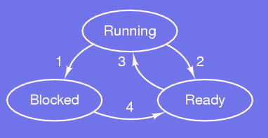
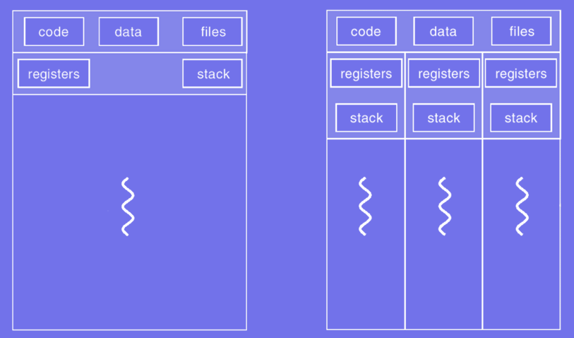
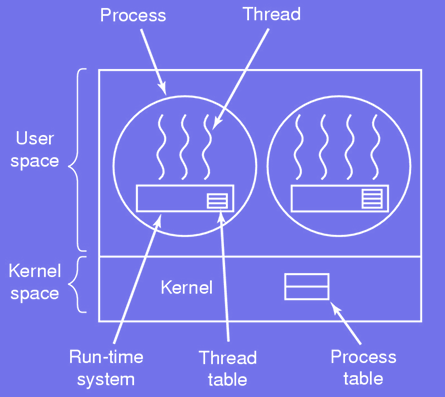
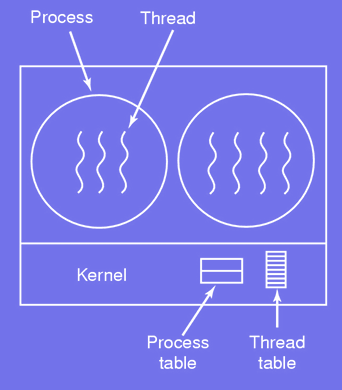
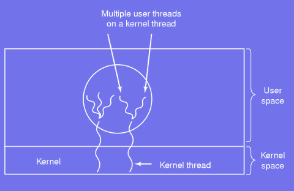

# Processes and Threads

## Processes
### Basics
#### KEY POINT: What is a process?

        A process is a running instance of a program that includes its executable code, data, and resources required during execution.

A *process* is an abstraction of a running program:
- At the core of the OS.
- Process is the unit for resource management.
- Turn a single CPU into multiple virtual CPUs.
- CPU quickly switches from process to process
- Each process run for 10-100 ms.
- Proceses hide the effect of interrupts.

---

### Mutliprogramming
Multiprogramming strategies and issues:
* CPU switches rapidly back and forth among all the processes.
* Rate of computation of a process is not uniform/reproducible.
* Potential issue under time constraints; e.g.
    - Read from tape
    - Idle loop for tape to get up to speed
    - Switch to another process
    - Switch back... too late

---

### Program vs. Process
Differences between programs and processes:
- Running twice a program generates two processes
- Program: sequence of operations to perform
- Process: program, input, output, state

---

### Process creation and termination
Times at which processes are created:
- System initialization
- Upon a user launching a new program
- Initilization of a batch job

Any created processes ends at some stage:
* Voluntarily:
    - The work is completed, issue a system call to inform the OS
    - An error is noticed, the process exits nicely
* Involuntarily:
    - Fatal error, program crashes
    - Another process kills it

---

#### KEYPOINT: How can processes be created and terminated? 

**Process Creation** 
Processes are created by the operating system using specific mechanisms. The parent process creates child processes, forming a hierarchy.

- **Methods of Creation**: 
 
    1. **System Calls** : 
    - In Unix/Linux: `fork()` is used to create a new process.
    
    - `exec()` can replace the child process's memory with a new program.
    
    - Windows uses `CreateProcess()`.
    
    2. **Parent-Child Relationship** :
    - The parent process spawns a child process, inheriting some attributes (e.g., open files).

- **Steps**: 

    1. Allocate resources (e.g., memory, I/O devices).

    2. Assign a unique Process ID (PID).

    3. Load program code into memory.

    4. Schedule the process for execution.  


**Process Termination** 

A process can be terminated when it finishes execution or is stopped due to an error or external intervention.

- **Methods of Termination**: 
 
    1. **Normal Termination** : 
    - Occurs when a process completes its task and calls an exit system call (e.g., `exit()` in Unix/Linux).
    
    2. **Error Termination** :
    - Happens due to an unhandled error, such as illegal memory access or division by zero.
    
    3. **Forced Termination** : 
    - A process can be killed by another process or the OS (e.g., using `kill` command in Unix/Linux or `TerminateProcess()` in Windows).


**Lifecycle Example** 
 
1. **Creation** : A parent process calls `fork()` to create a child.
 
2. **Execution** : The child runs its assigned task.
 
3. **Termination** : The child calls `exit()` after completing its work. The parent may retrieve its exit status using `wait()`.

---

### Process Hierarchies
Two main approaches:

* UNIX-like systems:
    - A parent creates a child
    - A child can create its own child
    - The hierarchy is called *process group*
    - It is impossible to disinherit a child

* Windows system:
    - All processes are equal
    - A parent has a token to control its child
    - A token can be given to another process

---

### Process States


Possible states:
1. Waiting for some input
2. Schedular picks another process
3. Schedular picks this process
4. Input becomes available

Change of perspective on the inside of the OS:
- Do not think in terms of interrupt but of process
- Lowest level of the OS is the schedular
- Interrupt handling, starting/stopping processes are hidden in the scheduler.

---

### [ Interview 1 ] What are the possible states of a process?

The **possible states of a process**  represent its status during execution. The key states are:  

**1. New** 
- The process is being created and initialized.
- It hasn’t started execution yet.

**2. Ready** 
- The process is loaded into memory and waiting to be assigned to the CPU.
- It is prepared to execute but is in the queue for scheduling.

**3. Running** 
- The process is actively being executed by the CPU.
- Only one process per CPU core can be in this state at a time.

**4. Waiting (or Blocked)** 
- The process is waiting for an event to occur, such as I/O completion or a resource becoming available.
- It cannot proceed until the event happens.

**5. Terminated (or Exit)** 
- The process has completed its execution or has been explicitly terminated.
- It releases all allocated resources.

**State Transitions** 
Processes move between these states based on scheduling, I/O, or completion of tasks. For example:
- **Ready → Running** : Scheduled by the CPU.
- **Running → Waiting** : I/O or resource request.
- **Running → Terminated** : Task completion.

---

### Modeling processes
A simple model for processes:
* A process is a data structure called *process control block*
* The structure contains important information such as:
    - State
    - Program counter
    - Stack pointer
    - Memory allocation
    - Open files
    - Scheduling information
* All the processes are stored in an array called *process table*.

---

### Interrupts and Processes
Upon an interrupt, the running process must be paused:
1. Push on the stack the user program counter, PSW, etc.
2. Load information from interrupt vector
3. Save registers (assembly)
4. Setup new stack (assembly)
5. Finish up the work for the interrupt
6. Decides which process to run next
7. Load the new process, i.e. memory map, registers, etc. (assembly)

---

### [ Interview 2 ] What's an orphan process? What about zombie process?
- **Orphan Process**: Parent terminates before the child; the OS adopts the child process.

- **Zombie Process**: Child terminates but remains in the process table until the parent collects its exit status.

---
---

## Threads
A **thread** is the smallest unit of execution within a process. It represents a single sequence of instructions that the CPU can execute.

### Overview
A thread is the basic unit of CPU utilization consisting of:
- A thread ID
- The program counter
- A register set
- A stack space  

All the threads within a process share the same:
- Code section
- Data section
- Operating system resources

### Single vs. Multi-threaded


#### KEY POINT: What is the difference between single thread and multi-threads?

* **Single Thread**  
    - **Definition** : A process with only one thread of execution.
    - **Execution** : Tasks are executed sequentially, one at a time.
    - **Performance** : Limited to a single CPU core; cannot leverage parallelism. 
    - **Example** : Simple command-line programs like a basic text editor.
  
* **Multi-Threads**  
    - **Definition** : A process with multiple threads of execution running concurrently.
    - **Execution** : Tasks can run in parallel, either on multiple cores or by time-sharing a single core.
    - **Performance** : Improves efficiency by dividing tasks and utilizing system resources effectively.
    - **Example** : A web server handling multiple client requests simultaneously.

* **Key Difference**: 
    - **Single-thread** : Simpler but slower for complex tasks.
    - **Multi-thread** : More complex but faster for tasks requiring concurrency or parallelism.

---
---

## Implementation
### POSIX threads
The `pthread` library has over 60 function calls:
- **Create a thread**:  
    ```c
    int pthread_create(pthread_t *thread, const pthread_attr_t *attr, void *(*start_routine)(void *), void *arg);
    ```
 
- **Terminate a thread** :

    ```c
    void pthread_exit(void *retval);
    ```
 
- **Wait for a specific thread to end** :

    ```c
    int pthread_join(pthread_t thread, void **retval);
    ```
 
- **Release CPU to let another thread run** :

    ```c
    int pthread_yield(void);
    ```
 
- **Create and initialize a thread attribute structure** :

    ```c
    int pthread_attr_init(pthread_attr_t *attr);
    ```
 
- **Delete a thread attribute object** :

    ```c
    int pthread_attr_destroy(pthread_attr_t *attr);
    ```

---

### Ex. Creating 10 threads and printing their ID

```C
1  #include <stdio.h>
2  #include <stdlib.h>
3  #include <pthread.h>
4  #define THREADS 10
5  void *gm(void *tid){
6      printf("Good morning from thread %lu\n",*(unsigned long int *) tid);
7      pthread_exit(NULL);
8  }
9  int main(){
10     int status, i; pthread_t threads[THREADS];
11     for(i = 0; i < THREADS; i++){
12         printf("thread%d\n",i);
13         status = pthread_create(&threads[i], NULL, gm, (void*)&(threads[i]));
14         if(status != 0) {
15             fprintf(stderr, "thread %d failed with error %d\n", i, status);
16             exit(-1);
17         }
18     }
19     exit(0);
20 }
```

---


## KEY POINT: What approaches can be taken to handle threads?
### Threads in User-space - N:1


A **user-space thread** is a thread managed entirely by a user-level library or application, without direct involvement from the operating system's kernel. The library handles thread creation, scheduling, and management.


- Kernel thinks it manages single threaded processes
- Threads implemented in a library
- Thread table similar to process table, managed by run-time system.
- Switching thread does not require to trap the kernel

**Questions**  
* What if a thread issues a blocking system call?

        If a user-space thread issues a blocking system call, the entire process is blocked because the operating system's kernel is unaware of the user-space threads. 
        The kernel sees the process as a single entity and does not differentiate between its threads. This limitation arises because the kernel blocks the process until the system call completes, effectively preventing other threads in the same process from making progress.

* Threads within a process have to voluntarily give up the CPU, why?

        Threads within a process, particularly user-space threads, operate under cooperative multitasking, where the thread scheduler relies on the threads themselves to voluntarily yield the CPU. 
        This is because the thread management happens at the user level, and the kernel is not aware of individual threads. If a thread does not yield the CPU, other threads in the same process cannot execute, leading to potential starvation or deadlock.

---

### Threads in kernel space - 1:1


**Kernel-space threads** are threads that are fully managed by the operating system's kernel. The kernel is aware of these threads, and it handles their creation, scheduling, and execution. Each thread is treated as a separate schedulable entity, allowing the OS to allocate CPU time and resources independently for each thread.

- Kernel manages the thread table
- Kernel calls are issued to request a new thread
- Calls that might block a thread are implemented as system call
- Kernel can run another thread in the meantime  s

**Questions**  
* Why does kernel-space threads have a much higher cost than user-space threads?

        Kernel-space threads involve frequent context switches between user and kernel modes, which require saving/restoring CPU states and transitioning privilege levels, making them slower. 
        User-space threads avoid this overhead by managing threads at the application level.

* Which thread receives a signal in a multi-threaded process?

    Signals are delivered to a specific thread based on the type of signal:

    - **Synchronous signals** (e.g., segmentation faults): Sent to the thread causing the signal.

    - **Asynchronous signals** (e.g., kill): Delivered to any thread, typically determined by the OS or application-specific settings. Signal-handling threads can also be designated by the application.

---

### Hybrid threads – M:N


**Hybrid threads**:

- Combination of user and kernel spaces threads
- A threading library schedules user threads on available kernel threads


**Questions** 

- **Implementing Hybrid Threads**   
    Hybrid threads combine user and kernel threads using an M mapping, where multiple user threads are mapped to fewer kernel threads. Implementation involves:

    1. A **user-level thread library**  to manage user threads.
    2. Kernel threads for **parallel execution**  and blocking operations.
    3. A mapping mechanism to link user threads to kernel threads dynamically.
    4. Efficient communication and handling of blocking operations to prevent stalling.

- **Scheduling Hybrid Threads**   
    Scheduling requires coordination between user-space and kernel-space schedulers:
    
    1. **Two-Level Scheduling** :
        - User-level scheduler manages user threads within each kernel thread.
        - Kernel scheduler allocates resources to kernel threads.
    2. **Load Balancing** : Distribute user threads evenly across kernel threads. 
    3. **Blocking Operations** : Dynamically remap blocked threads to active kernel threads.   
    4. **Dynamic Mapping** : Adjust thread mappings based on workload and resource availability.   
    5. **Priority Synchronization** : Align user and kernel thread priorities.
