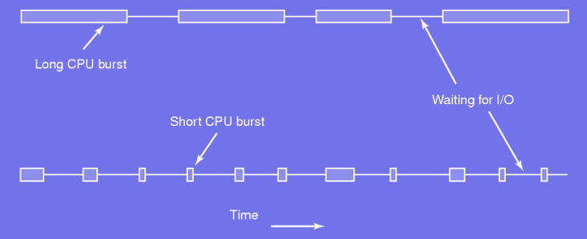
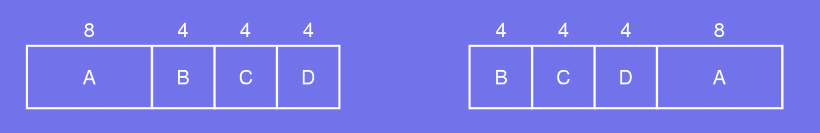
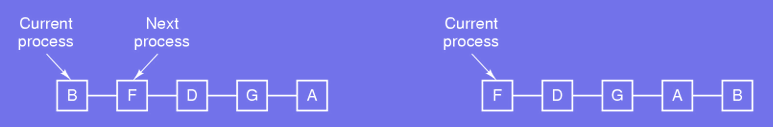
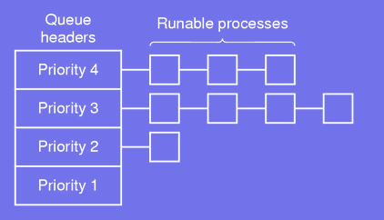
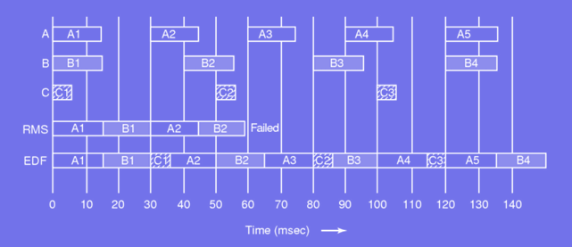
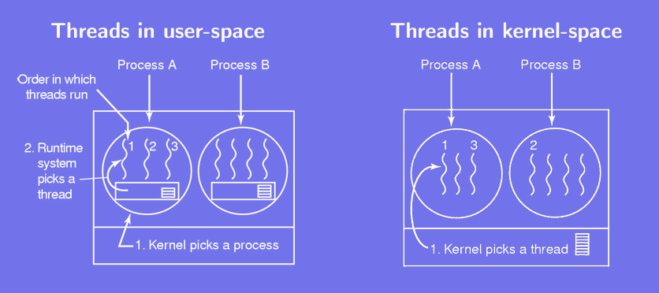

# Scheduling

## Requirements
### Initial Problem
#### Scheduler's job:
- Multiple processes competing for using the CPU
- More than one process in ready state
- Which one to select next?
- Key issue in terms of "perceived performance"
- Need "clever" and efficient scheduling algorithms

#### When to decide what process to run next:
- A new process is created
- A process exits or blocks
- IO interrupt from a device that has completed its task

### Schduler's job
#### Switching process is *expensive*:
- Switch from user mode to kernel mode
- Save state of current process (save register, memory map, etc.)
- Run scheduling algorithm to select a new process
- Remap the memory address for the new process
- Start new process

*Too many switches per second wastes much CPU*

### Process behavior


Typical behavior:
- Process runs for a while
- System call emitted to read (write) from (in) a file
- More general: process in blocked state until external device has completed its work

#### CPU Burst
A **CPU burst** refers to the period during which a process is actively executing instructions on the CPU without being interrupted or waiting for input/output (I/O) operations. It is the **time a process spends using the CPU before voluntarily giving up the CPU or being preempted**.

### Process behavior and scheduling times
#### Compute bound vs. input-output bound:
- Most time spent *computing vs. waiting for IO*
- Length of the CPU burst:
    - IO time is constant
    - Processing data is not constant
- As CPUs get faster processes are more and more IO bound

### Preemptive vs. non-preemptive
Two main strategies for scheduling algorithms:
- **Preemptive** (선제권이 있는):
    - A process is run for at most *n* ms
    - If it is not completed by the end of the period then it is suspended
    - Another process is selected and run
- **Non-preemptive**:
    - A process runs until it blocks or voluntarily releases the CPU
    - It is resumed after an interrupt unless another process with higher priority is in the queue.

#### Preemptive Scheduling
- Definition:  

    In preemptive scheduling, the operation system can **interrupt a running process** and reallocate the CPU to another process. The interrupted process is moved back to the ready queue and waits for its turn.

- How it works:
    - A process running on the CPU can be **preempted** if:
        1) A higher-priority process arrives.
        2) The current process exceeds its allocated CPU time slice (in time-sharing systems).
        3) A specific event, such as I/O completion, triggers rescheduling.

#### Non-Preemptive Scheduling
- Definition:  

    In non-preemptive scheduling, once a process is assigned to the CPU, it **runs to completion** or until it voluntarily releases the CPU (e.g., by requesting I/O or terminating).

- How it works:
    - The CPU remains allocated to the running process until:
        1) The process completes its CPU burst.
        2) The process makes and I/O request or terminates.

### Goals when scheduling
- All systems:
    - Fairness: fair share of the CPU for each process
    - Balance: all parts of the system are busy
    - Policy enforcement: follow the defined policy

- Interactive systems:
    - Response time: quickly process request
    - Proportionality: meet user's expectations

- Batch systems:
    - Throughput: maximize the number of jobs per hour
    - Turnaround time: minimize the time between submission and termination of a job
    - CPU utilization: keep the CPU as busy as possible

- Real-time systems:
    - Meet deadlines: avoid any data loss
    - Predictability: avoid quality degradation, e.g. for multimedia

## Common Scheduling Algorithms
### 1. First-come, first-served
#### Simplest algorithm but non-preemptive:
- CPU is assigned in the order it is requested
- Processes are not interrupted, they can run as long as they want
- New jobs are put at the end of the queue
- When a process blocks, the next in line is run
- Any blocked process becoming ready is pushed to the queue

**When to Use**:
- Batch-oriented systems with non-interactive tasks.
- Processes have similar CPU burst times.
- Fairness is a priority.
- Turnaround time and response time are not critical.  

**When to Avoid**:
- Systems with high variability in process lengths (convoy effect).
- Time-sharing or interactive systems requiring quick responses.
- Real-time systems with strict deadlines.
- When prioritization of processes is required.

### 2. Shortest job first


#### Non-preemptive algorithm with all run times known in advance:  
- Longest job first:
    - Run time: A: 8 min, B: 4 min, C: 4 min, D: 4 min
    - Turnaround time: (8 + 12 + 16 + 20) / 4 = 14 min
- Shortest job first:
    - Run time: B: 4 min, C: 4 min, D: 4 min, A: 8 min
    - Turnaround time: (4 + 8 + 12 + 20) / 4 = 11 min

**Appropriate Use**
- When all run times are known in advance (as in batch systems or predictable workloads).
- When the goal is to minimize average turnaround time, as shorter jobs can be scheduled earlier to reduce overall waiting.

**Avoid When**
- In interactive or real-time systems, where responsiveness is critical, as longer jobs can delay shorter or higher-priority ones.
- If run times are unpredictable, since the algorithm cannot dynamically adjust for new jobs or varying priorities.

### Round-Robin Scheduling
**Round-Robin (RR)** is a preemptive scheduling algorithm where each process gets a fixed time quantum to execute. If a process doesn't finish during its quantum, it is moved to the back of the ready queue, and the CPU switches to the next process.



#### Preemptive, simple, fair, and most widely used algorithm:
- Each process is assigned a time interval called **quantum**.
- A process runs until:
    - Getting blocked
    - Being completed
    - Its quantum has elapsed
- A process switch occurs

**When to Use**:
- Interactive systems requiring fairness and responsiveness.
- Scenarios with unknown burst times or mixed workloads.

**When to Avoid**:
- Real-time systems with strict deadlines.
- Workloads with long CPU bursts or when context-switch overhead is a concern.

### Priority Scheduling
**Priority Scheduling** is a preemptive algorithm where processes are assigned priorities, and the CPU always executes the process with the highest priority. Lower-priority processes only run when no higher-priority processes are available.



#### Preemptive algorithm allowing to define priorities based on who or what:
- Processes are more or less important, e.g. printing
- Creates priority classes
- Use Round-Robin within a class
- Run higher priority processes first

**When to Use**:
- Time-critical systems, like real-time or embedded systems.
- When processes have clearly defined levels of importance.

**When to Avoid**:
- Risk of starvation for low-priority processes.
- Workloads with frequently changing priorities or where fairness is essential.

### Lottery Scheduling
**Lottery Scheduling** is a preemptive scheduling algorithm that assigns lottery tickets to processes. A random ticket is selected to decide which process gets the CPU. Processes with higher priority get more tickets, increasing their chances of being selected.  

#### Preemptive algorithm which can extend priority scheduling:
- Processes get lottery tickets
- When a scheduling decision is made, a random ticket is chosen
- Price for the winner is to access resources
- High priority processes get more tickets

**When to Use**:
- Systems needing fairness and dynamic priority adjustment.
- To prevent starvation while maintaining priority differences.
- Interactive or soft real-time systems.

**When to Avoid**:
- Hard real-time systems with strict deadlines.
- Systems with predictable workloads or where deterministic behavior is critical.
- If managing tickets introduces significant overhead.

### Earliest Deadline First
**Earliest Deadline** First is a preemptive scheduling algorithm where processes are prioritized based on their deadlines. The process with the earliest deadline is executed first.



#### Priority based preemptive algorithm:
- Process needs to announce (i) its presence and (ii) its deadline
- Scheduler orders processes with respect to their deadline
- First process in the list (earliest deadline) is run

**When to Use**:
- Real-time systems with critical deadlines.
- Dynamic workloads where priorities change with deadlines.
- Systems handling periodic and aperiodic tasks.

**When to Avoid**:
- Non-real-time systems where fairness or throughput is more important.
- Overloaded systems where missed deadlines can cascade into failures.
- Systems with unpredictable workloads or high computational overhead for managing deadlines.

## Notes and Problems
### Policy vs. Mechanism
#### Limitations of the previous algorithms:
- They all assume that processes are competing
- Parent could know which of its children is most important

#### Separate the scheduling mechanism from the scheduling policy:
- Scheduling algorithm has parameters
- Parameters can be set by processes
- A parent can decide which of its children should have higher priority

#### Scheduling Mechanism:
- The **mechanism** refers ro the underlying algorithm or infrastructure used to determine which process gets the CPU.
- It defines how **processes are scheduled** (e.g., by priority, fairness, or time quantum).

#### Scheduling Policy
- The **policy** defines the **rules or parameters** used to influence the scheduling mechanism.
- It decides **what criteria should be used** to assign priorities, time quanta, or other scheduling parameters.

### Threads Scheduling


1. Threads in User-Space
    - How It Works:
        - The kernel **only sees processes**, not individual threads.
        - Inside a process, a user-space runtime system (e.g., thread library) is responsible for scheduling the threads.
        - The kernel decides which **process** to run, and then the **runtime system** within that process decides which thread gets executed.
    
    - Implications:
        - The order of threads running depends on:
        - The kernel's process scheduling (which process is picked first).
        - The runtime system’s thread scheduling inside each process.
    
    - Possible Running Orders:
        - `A1, A2, A3, A1, A2, A3`:
            - The kernel keeps picking **Process A**.
            - The runtime system within Process A schedules its threads in a round-robin or similar order.
        - `A1, B1, A2, B2, A3, B3`:
            - Not possible because the kernel doesn’t schedule individual threads across processes. It picks entire processes, so only threads within the same process can run consecutively.

2. Threads in Kernel-Space
    - How It Works:
        - The kernel is aware of individual threads and schedules them directly.
        - Threads from different processes can be interleaved, as the kernel treats threads as independent scheduling entities.

    - Implications:
        - The kernel can freely alternate between threads from different processes based on its scheduling policy.

    - Possible Running Orders:
        - `A1, A2, A3, A1, A2, A3`:
            - Possible if the kernel keeps scheduling all threads from **Process A** consecutively.
        - `A1, B1, A2, B2, A3, B3`:
            - Possible since the kernel directly schedules individual threads and can interleave threads from **Process A** and **Process B**.


### The Dining Philosophers Problem
#### Synchronization problem:
- A philosopher is either thinking or eating
- When he is hungry he takes:
    1) His left chop-stick
    2) His right chop-stick
- Eats
- Puts down his chop-sticks
- Thinks

#### First obvious solution:
- Wait for a chop-stick to be available
- Seize it as soon as it becomes available

*What if they all take the left chop-stick at the same time?*

#### Second solution:
- Take left chop-stick
- If right chopstick not available, put down the left one
- Wait for some time and repeat the process

*What if they all start at the same time?*

#### A solution using *mutex*:
- A philosopher thinks
- Locks mutex
- Acquires chop-sticks, eat, put them down
- Unlocks the mutex

*How many philosophers can eat at the same time?*

```C
 1  #define N 5
 2  #define LEFT (i+N-1)%N
 3  #define RIGHT (i+1)%N
 4  enum { THINKING, HUNGRY, EATING};
 5  int state[N]; mutex mut =0 ; semaphores[N];
 6  void philosopher(inti) {while(TRUE) {think();take_cs(i);eat();put_cs(i);}}
 7  void take_cs(int i){
 8      mutex-lock(&mut);
 9      state[i] =HUNGRY; test(i);
 10     mutex-unlock(&mut); down(&s[i]);
 11 }
 12 void put_cs(int i){
 13     mutex-lock(&mut);
 14     state[i] =THINKING; test(LEFT); test(RIGHT);
 15     mutex-unlock(&mut);
 16 }
 17 void test(inti) {
 18     if(state[i]==HUNGRY&&state[LEFT]!=EATING&&state[RIGHT]!=EATING;) {
 19         state[i]=EATING; up(&s[i]);
 20     }
 21 }
```

## KEY POINTS
### Why is scheduling the lowest part of the OS?
Scheduling is the "lowest" OS function because it directly manages CPU time and ensures that all processes execute efficiently, forming the foundation for system performance and multitasking.
### What are the two main types of algorithm?
- **Preemptive**: Focuses on fairness and responsiveness; processes can be interrupted.
- **Non-Preemptive**: Simpler but less responsive; processes run without interruption.
### What are the two most common scheduling algorithms?
- **Round-Robin (RR)**: Focuses on fairness and time-sharing.
- **Priority Scheduling**: Focuses on importance and prioritization.