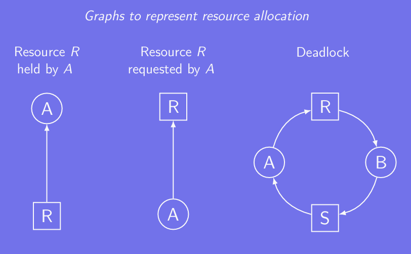
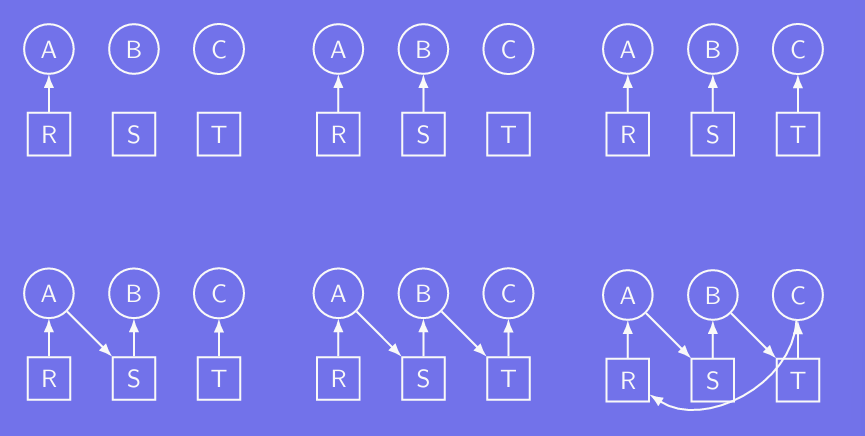
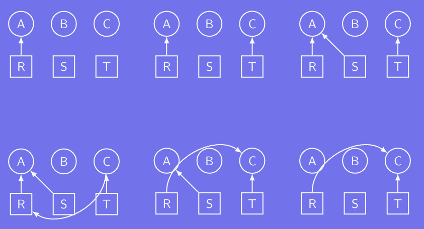

# Deadlocks

## Modeling the problem

### Resource types

#### Two main types of resources:
1. Preemptable Resources
    - Definition: Resources that can be taken away from a process and reassigned to another without causing data corruption, system instability, or process failure.

    - Examples:
        - Memory (RAM):

            If Process A uses all 256 MB of RAM but exceeds its CPU quantum, the OS can reassign memory to Process B. Later, Process A can resume its operation using the memory again without losing progress.

        - CPU Time:

            If a process is preempted (e.g., its time quantum expires), the CPU can switch to another process and return to the first process later without any adverse effects.

    - Use Case:

        Preemptable resources are suitable for multitasking systems where processes frequently switch in and out of execution.

2. Non-Preemptable Resources
    - Definition: Resources that cannot be safely taken away from a process without causing failure, data loss, or system inconsistency.

    - Examples:
        - DVD Burner:

            If Process A is burning a DVD, the DVD burner cannot be reassigned to Process B until Process A completes. Interrupting the burn process would corrupt the DVD.

        - Printer:

            A print job from Process A cannot be preempted to allow Process B to use the printer, as it would result in incomplete or mixed print outputs.
        
    - Use Case:

        Non-preemptable resources require careful scheduling or resource management to avoid deadlocks and ensure smooth operations.

### Representing deadlocks

### Example - Deadlock

### Example - No Deadlock

## Dealing with the problem

### Ostrich algorithm
The **Ostrich Algorithm** is a strategy where a system deliberately ignores rare problems (e.g., deadlocks), assuming the cost of prevention outweighs the likelihood of occurrence.

#### When to Use:
- Low probability of failure.
- Non-critical systems where occasional failures are tolerable.
- Cost of prevention exceeds the impact of the problem.

#### Advantages:
- Simple and resource-efficient.
- Avoids unnecessary complexity and overhead.

#### Disadvantages:
- Risk of failure if the problem occurs.
- Unsuitable for critical systems where reliability is essential.

## KEY POINTS
### 1. How to Detect Deadlocks?
#### Deadlock Detection Algorithms:
- Use resource allocation graphs:
    - Processes and resources are represented as nodes.
    - A **cycle in the graph** indicates a potential deadlock.
- For systems with multiple instances of resources:
    - Apply **Banker's Algorithm** to identify if processes are waiting indefinitely.

### 2. How to Fix a Deadlock in a Clean Way?
#### (1) Process Termination:
- Terminate one or more processes involved in the deadlock to break the cycle.
- Options:
    - Terminate all deadlocked processes.
    - Terminate processes one by one until the deadlock is resolved (usually based on priority or minimal cost).

#### (2) Resource Preemption:
- Take resources away from a process and assign them to another to resolve the deadlock.
- Ensure the preempted process can be safely restarted later.

#### (3) Rollback:
- Roll back one or more processes to a previous safe state and restart them, releasing resouces to resolve the deadlock.

#### (4) Prevention via Scheduling:
- Avoid deadlocks altogether by designing resource allocation strategies that prevent the four deadlocks conditions.

### 3. What Are the Four Conditions that Characterize a Deadlock?
A deadlock occurs when these four conditions hold simultaneously:

#### (1) Mutual Exclusion:
- At least one resource is held in a non-sharable mode (only one process can use it at a time).

#### (2) Hold and Wait:
- Processes holding resources are waiting for additional resources held by other processes.

#### (3) No Preemption:
- Resources cannot be forcibly taken away; they must be released voluntarily by the holding process.

#### (4) Circular Wait:
- A cycle exists in the resource allocation graph where each process is waiting for a resource held by the next process in the cycle.

### 4. What is a Common Practice Regarding Deadlocks?
#### (1) Prevention:
- Modify the system to **prevent one or more of the deadlock conditions**:
    - Example: Avoid circular wait by enforcing a specific resource allocation order.

- Use algorithm like the **Banker's Algorithm** to ensure safe resource allocation.
    
    The **Banker’s Algorithm**, proposed by Edsger Dijkstra, is a **deadlock avoidance algorithm** used in operating systems to ensure safe allocation of resources. It checks if the system can allocate resources to processes in such a way that it remains in a safe state and avoids deadlocks.

#### (2) Avoidance:
- Use resource allocation strategies that dynamically avoid unsafe states (e.g., **Banker's Algorithm**).

#### (3) Detection and Recovery
- Allow deadlocks to occur but use detection algorithms to identify and recover from them.

#### (4) Ignoring Deadlocks (Ostrich Algorithm):
- In non-critical systems, assume deadlocks are rare and ignore them. Allow users or administrators to intervene manually if needed.
