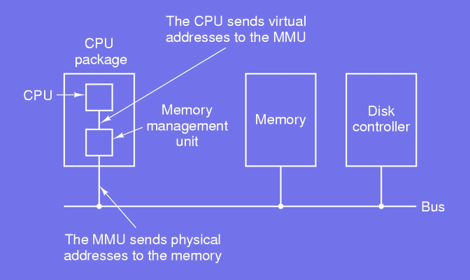

# Memory Management

## Handling Memory
### Memory Hierarchy

#### Problems related to memory:
- From expensive to cheap, fast to slow
- Job of the OS to handle the memory
    - How to model the hierarchy?
    - How to manage this abstraction?

### Memory Manager
#### Efficiently manage memory:
- Keep track of which part of the memory is used.
- Allocate memory to processes when required
- Deallocate memory at the end of a process

*Remark*. It is the job of the hardware to manage the lowest levels of cache memory.

### Simplest Model
#### No memory abstraction:
- Program sees the actual physical memory
- Programmers can access the whole memory
- Limitations when running more than one program:
    - Have to copy the whole content of the memory into a file when switching program
    - No more than one program in the memory at a time
    - More than one program is possible if using special hardware

### Address Space
#### *No abstraction* leads to two main problems:
1. Protection: prevent program from accessing other's memory
    - Without abstraction, every program can access any part of the physical memory.
    - Risks:
        - A program can accidentally or maliciously overwrite another program's memory or even the OS's memory.
        - It leads to system instability, crashes, or security vulnerabilities.
2. Relocation: rewrite address to allocate personal memory
    - Programs often need to run at specific memory locations
    - If multiple programs are loaded into memory, their addresses may conflict.
    - Manually rewriting addresses for each program to avoid conflicts is error-prone and impractical.

#### A solution is to set an *address space*:
1. Definition of **Address Space**:
    - An address space is a logical view of memory assigned to a process.
    - It represents the range of memory addresses a process can use.
    - The address space is **independent of the physical memory**.
2. Benefits:
    - Protection:
        - Each process has its own isolated address space.
        - One process cannot directly access or interfere with another's process's memory.
        - This isolation is enforced by hardware (e.g., Memory Management Unit, MMU).
    - Relocation:
        - The OS and hardware dynamically map a process's logical addresses (virtual addresses) to physical memory.
        - Processes are written using logical addresses, and the MMU transparently handles translation to physical addresses at runtime.

### Memory Size Limitation

#### When booting many processes are started:
- As more programs are run, more and more memory is needed.
- More memory than available might be needed.
- Processes are swapped in (out) from (to) the disk.
- OS has to manage dynamically assigned memory.

### Bitmap and linked lists

#### Simple idea:
- Define some base size for an area *s*
- Split up the whole memory into *n* chunks of size *s*
- Keep track of the memory used is a bitmap or linked list

- **Bitmaps** are better suited for systems with fixed-sized chunks and relatively uniform memory usage patterns.
- **Linked lists** are more effective for systems with variable-sized allocations, as they offer more flexibility but at the cost of complexity.

### Allocating Memory
#### Ways to assign memory to processes:
1. First Fit: search of a hole big enough and use the first found
2. Best Fit: search whole list and use smallest, big enough hole
3. Quick Fit: maintain lists for common memory sizes, use the best

#### Characteristics:
- Speed: quick fit > first fit > best fit
- Locally optimal: quick fit = best fit > first fit
- Globally optimal: first fit > quick fit = best fit

### Basic Idea
#### Virtual Memory:
**Virtual memory** is a memory management technique that allows processes to use more memory than is physically available by abstracting the physical memory into a larger, logical address space.

- Generalization of the base and limit registers
    - In simpler systems, each process has a **base register** (indicating the starting address of its allocated memory) and a **limit register** (indicating the size of the memory segment).
- Each process has its own address space
    - Each process operates in its **own private address space**:
        - The process perceives this space as contiguous and unlimited.
        - The OS and hardware manage how virtual addresses map to physical addresses.
- The address space is split into chunks called *pages*
- Each page corresponds to a range of addresses
- Pages are mapped onto physical memory
    - Pages in the virtual address space are **mapped** to **frames** in physical memory using a **page table**.
        - A **page table** keeps track of where each virtual page is located in physical memory.
        - Some pages may not be in physical memory at all and are stored in secondary storage (e.g., swap space on the disk).
- Pages can be on different medium, e.g. RAM and swap
    - Virtual memory allows pages to reside in:
        - **RAM** (fast, for frequently accessed pages).
        - **Swap space** (on a disk, used as overflow storage when RAM is full).
    - When a process accesses a page that is in swap space (not in RAM), a **page fault** occurs:
        - The OS retrieves the page from the disk and loads it into RAM.
        - This mechanism extends the system's effective memory capacity but can slow performance if disk access is frequent.

### The Swap Area
#### Swap partition principles:
- Simple way to allocate page space on the disk
- OS boots, swap is empty and defined by two numbers: its origin and its size
- When a process starts, its swap area is reserved and initialized.
- The new "origin" is computed.
- When a process terminates, its swap area is freed.
- The swap is handled as a list of free chunks.

### Initializing the Swap Area

- Two main strategies:
    - Copy the whole process image to the swap area
    - Allocate swap disk space on the fly

### Memory Management Unit

- Very low-level hardware memory management.
- Fast but won't be able to do much

- mm, arch

## Paging 
### Virtual Page and Page Frame 

#### Organizing the memory:
- Divide the virtual address space into fixed-size units called *pages*.
- Pages and *page frames* are usually of same size
- MMU maps virtual addresses to physical addresses
- MMU causes the CPU to trap on a page fault
- OS copies content of a little used page onto the disk
- Page frame loaded onto newly freed page

### Page Table

#### Structure of a page entry:
- Present|absent : 1|0; missing causes a page fault
- Protection: 1 to 3 bits: reading/writing/executing
- Modified: 1|0 = dirty|clean; page was modified and needs to updated on the disk
- Referenced: bit used to keep track of most used pages; useful in case a page fault
- Caching: important for pages that map to registers; do not want to use old copy so set caching to 0

### Paging 
#### Two main issues must be solved in a paging systme:
- Mapping must be done efficiently
- A large virtual address space implies a large page table
#### Translation Lookaside Buffer (TLB):
- Hardware solution implemented inside the MMU
- Keeps track of few most used pages
- Features the same fields as for page table entries including the virtual page number and page frame.

### Page Replacement
On a **page fault** the following operations are performed:
- Choose a page to remove from the memory
- If the page was modified while in the memory, it needs to be rewritten on the disk; otherwise nothing needs to be done
- Overwrite the page with the new memory content

*How to optimize the selection of the page to be evicted?*

### Page Replacement - Optimal Solution
Determining which page to remove when a **page fault** occurs:
- Label and order all the pages in memory
- Pages with lower labels are used first
- Pages with larger label are swapped out of the memory

*Can the information be known ahead of time?*

### Page Replacement - LRU
*Recently heavily used pages are very likely to be used again soon*

#### Hardware solution, for *n* page frames:
- Initialize a binary *n x n* matrix to 0
- When a frame *k* is used set row *k* to 1 and column *k* to 0
- Replace the page with the smallest value

### Page Replacement - Aging
- Simulating LRU in software:
    - For each page initialize an *n*-bit software counter to 0
    - At each clock interrupt, the OS scans all the pages in memory
    - Shift all the counters by 1 bit to the right
    - Add $2^{n-1}$. *R* to the counter.

- Example. *n* = 8 with 4 pages over 4 clock interrupts

### Definitions
Basic notions related to **paging**:
- Demand paging: pages are loaded on demand
- Locality reference: during an execution phase, a process only accesses a small fraction of all its pages
- Working set: set of pages currently used by a process
- Thrashing: process causes many page fault due to a lack of memory
- Pre-paging: pages loaded in memory before letting process run
- Current virtual time: amount of time during which a process has used to CPU
- t (tow): a constant representing the age of the working set

### Page Replacement - WSClock
The **WSClock (Working Set Clock)** algorithm is a **page replacement strategy** that combines the concepts of the **working set model** and the **clock replacement algorithm**. It efficiently determines which pages to replace based on the page's recency of use and their necessity in the current working set.

#### Algorithm Steps
1. Data Structures:
    - Each page has the following attributes:
        - **Reference Bit (R):**: Indicate if the page was accessed recently.
        - **Age**: Timestamp of the page's last access.
        - **Modified Bit (M)**: Indicates if the page is dirty (modified).

2. Clock Hand Traversal:
    - The algorithm maintains a circular list of pages.
    - The clock hand sweeps through the list, checking one page at a time.

3. **Page Evaluation**: For each page, the algorithm evaluates based on the following conditions:
    - Case 1: **Page is in the working set ($R = 1$ and $age >= τ$)**:
        - Reset $R$ to 0 and move to the next page.
        - This means the page is still needed and remains in memory.
    - Case 2: **Page is not in the working set ($R = 0$ and $age > τ$)**:
        - Check $M$:
            - If $M = 1$ (dirty page): Schedule the page to be written to disk and continue searching.
            - If $M = 0$ (clean page): Replace the page immediately.
    - Case 3: **Page is clean but not in the working set ($R = 0 and M = 0$)**:
        - Replace the page immediately.

4. Repeat Search if Necessary:

    If non suitable page is found in one complete sweep, the algorithm writes a dirty page to disk and replaces it.

### Local vs. Global Allocation
Onto which set should the page replacement algorithm be applied:
- Local, i.e. within the process:
    - Allocate a portion of the whole memory to a process
    - Only use the allocated portion
    - Number of page frames for a process remains constant
- Global, i.e. within the whole memory:
    - Dynamically allocate page frames to a processes
    - Number of page frames for a process varies over time

*Which approach is best?*

