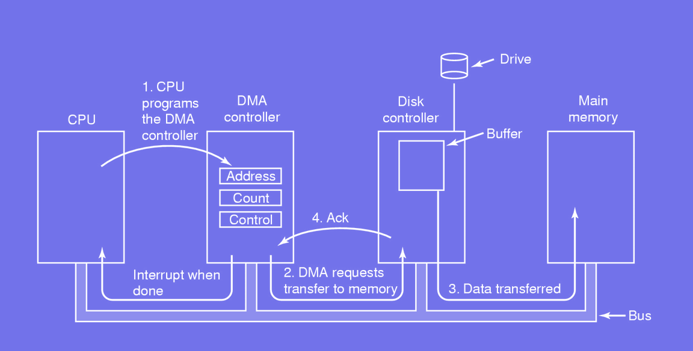
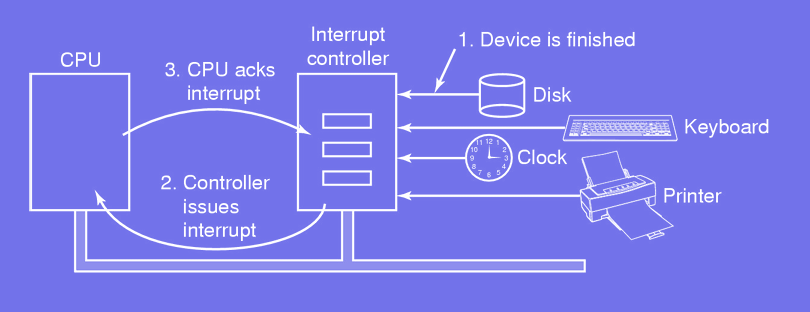

# Input-Output

## Basic Hardware

### OS and Input-Output
#### The OS controls all the IO:
- Send commmands to the device
- Catch interrupts
- Handle errors

#### Two main device categories
- **Block devices**:
    - Stores information in blocks of fixed size
    - Can directly access any block independently of other ones
- **Character devices**:
    - Delivers or accepts a stream of characters
    - Not addressable, no block structure
- **Clock**: Cause interrupts at some given interval

*The OS provides a simple way to interface with hardware*

### Device Controller
#### Most devices have two parts:
- Mechanical: the device itself
- Electronic: the part allowing to communicate with the device

#### The electronic part is called the *device controller*:
- Allows to handle mechanical part in an easier way
- Performs error corrections for instance in the case of a disk
- Prepares and assemble blocks of bits in a buffer
- Blocks can then be copied into the memory

### Memory-mapped IO
#### The CPU communicates with the device using *control registers*:
- OS writes on registers to: `send|accept` data, `switch` device on|off
- OS reads from registers to: know device's state

#### Modern approach
- Map the buffer to a memory address
- Map each register to a unique memory address or IO port

### Memory-mapped IO
#### Strengths:
- Access memory not hardware: no need for assembly
- No special protection required: control register address space not included in the virtual address space
- Flexible: a specific user can be given access to a particular device
- Different drivers in different address spaces: reduces kernel size and does not incur any interference between drivers

*Since memory words are cached what if the content of a control register is cached?*

### Direct Memory Access

## Hardware Interrupts

### Reminders

### Precise interrupts
#### Interrupt handling on a basic setup:
- Push program counter (PC) and PSW on the stack
- Handle the interrupt
- Retrieve program counter and PSW from the stack
- Resume the process

#### Precise interrupt:
- Program counter represents the precise progress
- All instructions before PC have been completed
- No instruction after the one pointed by PC have been executed
- Execution state of the instruction pointed by PC is known

*What are the consequences of more advanced architecture such as pipelined of superscalar CPU?*

### Imprecise interrupts
*An interrupt which is not precise called imprecise interrupt*

#### Difficult to figure out what happened and what has to happen
- Instructions near PC are in different stages of completion
- General state can be recovered if given many details
- Code to resume process is complex
- The more details the more memory used

*Imprecise interrupts are slow to process, what is an optimal strategy?*